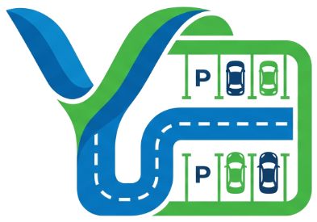

<p align="center">
  
</p>

<h1 align="center">YallaPark</h1>
<p align="center">
  <strong>Smart Mobility & Predictive Urban Parking Platform for Dubai</strong>
</p>

<p align="center">
  <a href="https://kotlinlang.org/"></a>
  <a href="https://www.jetbrains.com/compose-multiplatform/"></a>
  <a href="https://www.mongodb.com/atlas"></a>
  <a href="https://openrouter.ai/"></a>
  <a href="https://ultralytics.com/"></a>
</p>

<p align="center">
  <a href="#overview">Overview</a> &bull;
  <a href="#the-two-pathway-architecture">Two Pathways</a> &bull;
  <a href="#key-features">Key Features</a> &bull;
  <a href="#technology-stack">Tech Stack</a> &bull;
  <a href="#architecture">Architecture</a> &bull;
  <a href="#quick-start--local-preview">Quick Start</a> &bull;
  <a href="#hackathon-team">Team</a>
</p>

---

## Overview

**YallaPark** is an intelligent urban mobility and predictive parking platform engineered to eliminate parking search congestion across Dubai's most congested commercial and residential districts: **Bur Dubai, Al Karama, Deira Gold Souq, and Downtown Dubai**.

Built with **Kotlin Multiplatform (KMP)** and **Compose Multiplatform**, YallaPark runs natively across **Android, iOS, Desktop (JVM), and Web (WASM)**.

### The Urban Challenge in Dubai
In high-density commercial corridors, drivers circling for open bays create severe compounding issues:
- **Secondary Congestion**: Slow-moving search traffic gridlocks key arterials.
- **Environmental Waste**: Excess CO2 emissions and fuel burned in repetitive search loops.
- **Double-Parking Friction**: Delivery riders (Talabat, Careem, Deliveroo) double-park due to absence of designated quick bays.
- **Inefficient Bay Allocation**: Off-street and adjacent bays remain underutilized while curbs overflow.

### The YallaPark Solution
YallaPark replaces the traditional "circle and search" with a **guaranteed, predictive reservation framework**:
- **Predictive Slot Availability**: Statistical slot decay algorithms compute the arrival-time probability of open spots based on historical turn rates and driver ETA.
- **15-Minute Guaranteed Pre-Booking**: Hold slots prior to arrival with Dubai RTA NOL card, Apple Pay, Google Pay, or credit/debit card.
- **Inclusivity & Specialized Bays**: Dedicated mapping, visual filters, and turn-by-turn guidance for:
  - **People of Determination (POD)** accessible bays.
  - **Women-Only (Pink)** designated parking bays in secure, well-lit areas.
  - **Delivery Courier Quick Bays** (15–20 min short stays) to prevent double parking.
  - **DEWA EV Charging Bays** with real-time plug availability.
- **Gamified Eco-Rewards**: Drivers earn green mobility tokens for off-peak parking or utilizing park-and-ride hubs, redeemable at local Dubai merchants.

---

## The Two-Pathway Architecture

YallaPark approaches parking intelligence from both automated aerial observation and enterprise municipal infrastructure:

```
                  ┌────────────────────────────────────────────────────────┐
                  │                 YallaPark Data Plane                   │
                  └──────────┬─────────────────────────────────┬───────────┘
                             │                                 │
              ┌──────────────┴──────────────┐   ┌──────────────┴──────────────┐
              │            Way 1            │   │            Way 2            │
              │  Aerial / Drone CV Pipeline │   │ Municipal Operator Console  │
              │     (python-pipeline/)      │   │    (composeApp/admin/)      │
              └──────────────┬──────────────┘   └──────────────┬──────────────┘
                             │                                 │
                             ▼                                 ▼
                     YOLOv8-OBB Detection             Live Telemetry Grid
                   OSM Overpass Lot Polygons       Dynamic Tariffs & Overrides
                    MongoDB Atlas Sync Feed         POD / Pink Bay Management
```

### Way 1: Automated Aerial / Satellite & Drone Detection Pipeline (`python-pipeline/`)
Because free satellite imagery (Sentinel-2 at 10m, Landsat at 30m) is too coarse for individual 2.5m x 5m bays, YallaPark provides an automated spatial pipeline for high-resolution aerial and drone data:
1. **OSM Lot Polygons**: Extracts exact Dubai parking geometries via OpenStreetMap Overpass API (`fetch_osm_lots.py`).
2. **YOLO-OBB Vehicle Detection**: Oriented Bounding Box detector (`yolov8n-obb`) trained on aerial datasets (DOTA/COWC) to detect angled vehicles (`detect_occupancy.py`).
3. **Polygon Containment**: Runs spatial point-in-polygon containment to determine exact lot occupancy rates.
4. **Data Bridge & Atlas Sync**: Exports telemetry feeds directly to local JSON and syncs with MongoDB Atlas (`export_to_yallapark.py`).

```bash
# Run lightweight simulator pipeline
cd python-pipeline
python3 -m pip install -r requirements.txt
python3 run_prototype.py

# Optional: Run full YOLO-OBB inference
python3 -m pip install -r requirements-yolo.txt
```

### Way 2: Government & Facility Operator Admin Console (`composeApp/admin`)
An enterprise console designed for the **Dubai Roads and Transport Authority (RTA)**, **Mawaqif**, and commercial parking operators:
- **Facility Lifecycle**: Deploy or retire parking facilities with custom zones, geofences, and bay counts.
- **Bay Allocation Matrix**: Configure individual bays as Standard, POD, Women-Only Pink, Delivery Courier, or EV Charging.
- **Real-Time Sensor Simulator**: Interactive telemetry grid (Available, Occupied, Reserved, Maintenance) with gate sensor simulation.
- **Dynamic Tariffs**: Set base hourly tariffs, peak-hour congestion multipliers, and courier grace periods.
- **Multi-Tenant Role Switcher**: Switch instantly between Motorist, RTA Public Authority, Mawaqif Operator, and Private Commercial Operator.

---

## YallaPark AI Concierge (OpenRouter Integration)

An intelligent conversational mobility assistant powered by OpenRouter (`openai/gpt-4o-mini`):
- Natural language answers to Dubai parking regulations, tariffs, and zone rules.
- Instant routing advice for specialized bays (e.g., *"Where can I find pink parking bays near Al Karama?"* or *"What is the hourly tariff at Deira Gold Souq?"*).
- Context-aware assistance for POD permits, delivery courier grace periods, and off-peak rewards.

---

## Key Features

| Capability | Driver Experience | Authority / Operator (Admin) |
|---|---|---|
| **Interactive Map** | Custom vector canvas map with Dubai zone pills (Bur Dubai, Karama, Deira, Downtown) | Citywide facility heatmaps and live occupancy KPIs |
| **Bay Inclusivity** | Instant filters for POD, Women-Only Pink, Delivery Rider, and EV | One-tap bay reconfiguration and allocation overrides |
| **ETA Forecasting** | Real-time predictive slider (5–60 min ETA) with decay probability gauge | Dynamic congestion pricing and peak multiplier controls |
| **Booking & Passes** | 15-minute slot lock; Apple Pay, Google Pay, Dubai RTA NOL card | ANPR gate simulator and digital pass validation |
| **Flexibility** | 1-click remote session extension (+15m, +30m, +1h) | Overstay monitoring and enforcement alerts |
| **Sustainability** | Earn green mobility points redeemable across Dubai merchants | Off-peak demand leveling analytics |

---

## Architecture

```
jetbrains-hackathon/
├── composeApp/                                 # Shared UI Layer (Compose Multiplatform)
│   ├── src/commonMain/kotlin/
│   │   ├── com/yallapark/
│   │   │   ├── App.kt                          # Top-level Navigation & Role Switcher
│   │   │   └── ui/
│   │   │       ├── components/
│   │   │       │   ├── DubaiZoneMap.kt         # Custom Canvas vector map of Dubai
│   │   │       │   ├── BayIndicatorCard.kt     # POD, Pink, Delivery, EV status cards
│   │   │       │   ├── OccupancyProgressBar.kt # Visual occupancy & congestion gauge
│   │   │       │   └── PredictiveSlider.kt     # Dynamic ETA arrival probability slider
│   │   │       ├── screens/
│   │   │       │   ├── auth/                   # Login & Authentication Screen
│   │   │       │   ├── home/                   # Landing Home Screen
│   │   │       │   ├── driver/                 # MapExplorer, LotDetail, BookingFlow, ActiveSession, Rewards
│   │   │       │   ├── admin/                  # AdminDashboard, ManageLots, BayConfig
│   │   │       │   └── ai/                     # YallaAiScreen (OpenRouter Concierge)
│   │   │       └── theme/                      # Dubai RTA-aligned palette (Teal, Gold, Pink)
│   │   └── com/communityconnect/               # App entry points
│   ├── src/androidMain/                        # Android entry point & manifest
│   ├── src/iosMain/                            # iOS SwiftUI bridge
│   ├── src/desktopMain/                        # Desktop JVM runner
│   └── src/wasmJsMain/                         # Web (WASM) runner & resources
├── shared/                                     # Core Multiplatform Business Logic
│   ├── src/commonMain/kotlin/com/yallapark/
│   │   ├── domain/
│   │   │   ├── model/                          # ParkingLot, ParkingBay, Reservation, Forecast, UserRole
│   │   │   └── repository/                     # ParkingRepository, AdminRepository, ReservationRepository
│   │   ├── data/
│   │   │   ├── engine/                         # PredictiveOccupancyEngine (Slot decay models)
│   │   │   └── repository/                     # YallaParkRepositoryImpl
│   │   ├── presentation/viewmodel/             # MapViewModel, AdminViewModel, BookingViewModel, AuthViewModel
│   │   └── ai/                                 # OpenRouterClient & YallaAiViewModel
│   └── src/commonMain/resources/               # Bundled telemetry (dubai_parking_live.json)
├── python-pipeline/                            # Way 1 Aerial/Drone Computer Vision Pipeline
│   ├── fetch_osm_lots.py                       # Extracts Dubai parking polygons via OSM API
│   ├── detect_occupancy.py                     # YOLO-OBB detection & polygon containment
│   ├── export_to_yallapark.py                  # Telemetry exporter & MongoDB Atlas sync
│   └── run_prototype.py                        # End-to-end prototype runner
├── server/                                     # Unified Ktor Backend & MongoDB Gateway
└── wasmJsApp/                                  # Web WASM build scaffolding
```

---

## Technology Stack

| Layer | Technology | Details |
|---|---|---|
| **Cross-Platform UI** | Compose Multiplatform | Single UI codebase for Android, iOS, Desktop JVM, and Web WASM |
| **Language** | Kotlin 2.0+ & Python 3.9+ | 100% Kotlin for UI, shared domain & viewmodels; Python for Way 1 CV pipeline |
| **Map Rendering** | Custom Compose Vector Canvas | Lightweight Canvas map with zero external third-party SDK dependencies |
| **Networking & Async** | Ktor Client + Coroutines | ContentNegotiation, Kotlinx Serialization, StateFlow, SharedFlow |
| **AI Integration** | OpenRouter API | Model: `openai/gpt-4o-mini` with Dubai mobility system prompting |
| **Database & Cloud** | MongoDB Atlas | Cloud-hosted live occupancy store with reactive local fallback telemetry |
| **Computer Vision** | YOLOv8-OBB & Shapely | Oriented bounding boxes (`yolov8n-obb.pt`) with polygon spatial intersection |

---

## Quick Start & Local Preview

### Containerized Preview & Public Dev Tunnel
Launch the browser preview and public development tunnel with Docker:

```bash
docker compose up -d
```

- **Local Web App**: [http://localhost:8080](http://localhost:8080)
- **Public Tunnel**: Retrieve the live Cloudflare Quick Tunnel link with:
  ```bash
  ./scripts/tunnel-url.sh
  ```

To include the Python aerial detection pipeline alongside the preview:

```bash
docker compose --profile pipeline up --build -d
```

To stop all services:
```bash
docker compose down
```

---

## Hackathon Team

- **Nikhil Mundhra** — *Platform Architecture & Lead (Kotlin & Compose Multiplatform)*
- **Sashini Manikandan** — *Database & Cloud Integration (MongoDB Atlas & Backend)*
- **Parth Sanjay Badgujar** — *AI & Spatial Analytics (OpenRouter LLM & Way 1 Vision Pipeline)*
