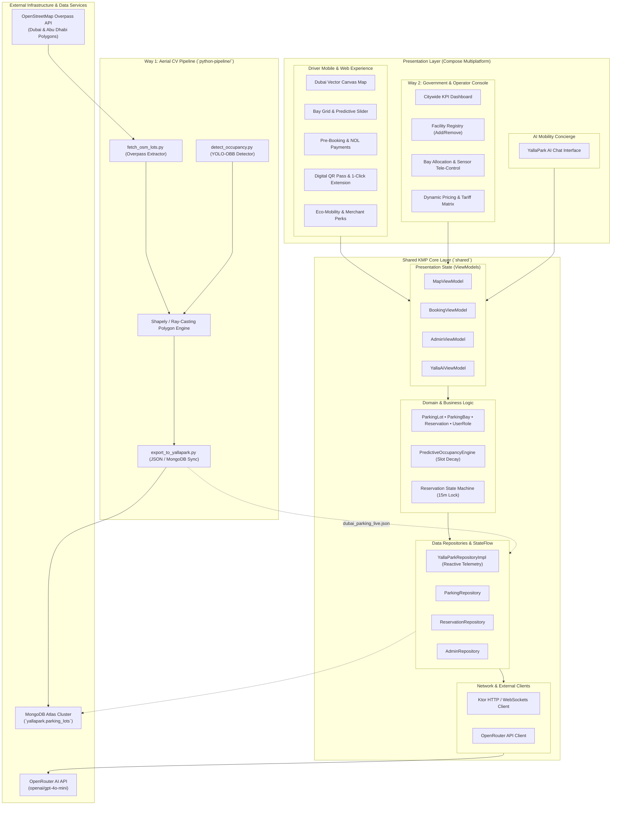
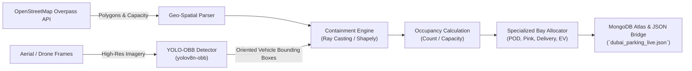
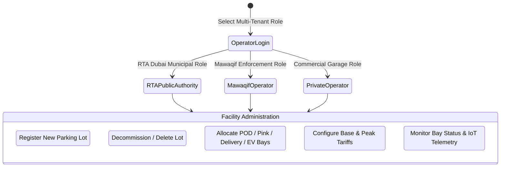
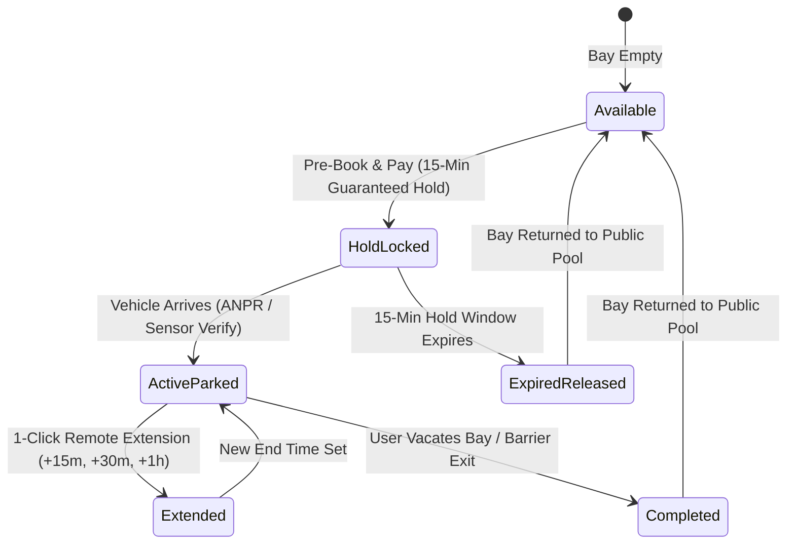
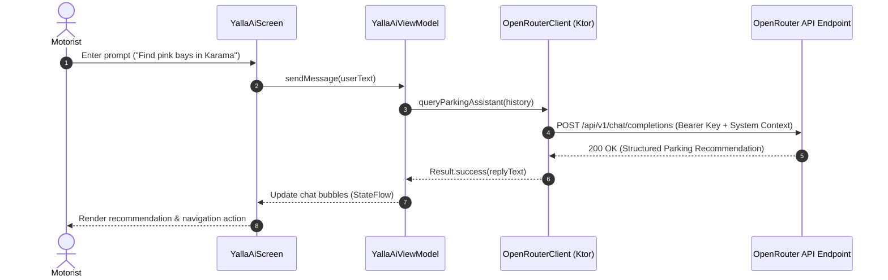

# YallaPark — System Architecture & Technical Design Document

## 1. Executive Architectural Overview

**YallaPark** is an intelligent urban mobility and predictive parking platform engineered for Dubai's highest-density commercial and residential corridors (**Bur Dubai, Al Karama, Deira, and Downtown Dubai**). The system combines a unified **Kotlin Multiplatform (KMP)** core, **Compose Multiplatform** cross-platform client interfaces, an **AI Smart Mobility Concierge** powered by OpenRouter, and a dual-pathway parking detection and management engine:
- **Way 1**: Automated computer vision pipeline using OpenStreetMap (OSM) polygons and YOLO-OBB oriented vehicle detection for aerial/drone/satellite occupancy estimation.
- **Way 2**: Multi-tenant enterprise admin console for municipal authorities (RTA Dubai, Mawaqif) and private parking operators to register, configure, and tele-control parking facilities in real time.



---

## 2. Kotlin Multiplatform (KMP) Architecture

YallaPark leverages **Kotlin Multiplatform** to maximize logic reuse while maintaining native performance across Android, iOS, Desktop (JVM), and Web (WASM).

### 2.1 Layer Separation
1. **Shared Core (`shared/commonMain`)**:
   - Contains **100% of domain models, business logic, validation rules, state machines, viewmodels, and network synchronization**.
   - Platform independence: Zero platform-specific APIs in the core domain layer.
2. **Shared UI (`composeApp/commonMain`)**:
   - Single declarative UI codebase built with **Compose Multiplatform (Material 3)**.
   - Includes custom vector rendering (`DubaiZoneMap.kt`), responsive layouts, theme styling, and screen transitions.
3. **Platform Entry Points**:
   - `androidApp` / `composeApp/androidMain`: Android `MainActivity` with edge-to-edge Compose rendering.
   - `iosApp` / `composeApp/iosMain`: iOS `ComposeUIViewController` wrapped in SwiftUI/UIKit.
   - `desktopApp` / `composeApp/desktopMain`: JVM desktop runner via `singleWindowApplication`.
   - `wasmJsApp` / `composeApp/wasmJsMain`: Web browser runner via Compose WASM viewport.

---

## 3. Way 1: Aerial & Drone Computer Vision Pipeline

Free satellite platforms (Sentinel-2 at 10m, Landsat at 30m, PlanetScope at 3m) lack the resolution to distinguish 2.5m x 5m parking bays. High-resolution aerial imagery (30–50 cm/px) or drone telemetry is required. Way 1 implements a working prototype spatial analytics pipeline:



### 3.1 Pipeline Components (`python-pipeline/`)
1. **`fetch_osm_lots.py`**:
   - Queries the Overpass API for parking polygons (`amenity=parking`) across Dubai pilot zones (`dubai_bur_dubai`, `dubai_karama`, `dubai_deira`, `dubai_downtown`) and Abu Dhabi.
   - Parses node coordinates into closed geometric polygons and normalizes metadata (capacity, access, parking type).
2. **`detect_occupancy.py`**:
   - Uses YOLOv8 with Oriented Bounding Boxes (OBB) to detect small vehicles regardless of orientation.
   - Implements a pure-Python Ray-Casting algorithm with automatic fallback to Shapely for polygon containment:
     $$\text{contains}(P, V_i) = \text{true if ray from } V_i \text{ crosses odd number of edges of } P$$
   - Calculates real-time occupancy ratio:
     $$\text{Occupancy Rate} = \min\left(1.0, \frac{\sum V_i \in P}{\text{Capacity}}\right)$$
3. **`export_to_yallapark.py`**:
   - Formats spatial results into YallaPark domain entities with specialized bay ratios.
   - Upserts records directly to MongoDB Atlas cluster (`yallapark.parking_lots`) and exports bundled JSON feeds.

---

## 4. Way 2: Government & Operator Admin Console

Way 2 provides public authorities and commercial facility operators with live oversight and configuration controls:



### 4.1 Multi-Tenant Role Matrix
- **`RTA_AUTHORITY`**: Regulates citywide public parking, sets municipal parking zones (Zone A/B), enforces accessibility and women-only standards, and audits revenue.
- **`MAWAQIF_OPERATOR`**: Focuses on zone-level enforcement, turnover tracking, and IoT sensor health monitoring.
- **`PRIVATE_OPERATOR`**: Manages commercial garages, adjusts dynamic hourly rates, and controls capacity allocation for shoppers, hotel guests, and contract parkers.

### 4.2 Facility Lifecycle & Live Tele-Control
- **Add Parking Facility**: Dynamic creation with custom zone boundaries, capacity, and dedicated bay allocations (POD, Women-Only Pink, Delivery Rider).
- **Remove Parking Facility**: Real-time decommissioning instantly reflected across all motorist clients.
- **Bay Telemetry & Sensor Simulation**: Operators can inspect individual bays and toggle their states (`AVAILABLE` $\leftrightarrow$ `OCCUPIED` $\leftrightarrow$ `RESERVED`), simulating ANPR gate cameras and magnetic ground sensors.

---

## 5. Predictive Availability & Slot Decay Engine

Traditional parking apps only display the *current* state of a parking lot. By the time a driver travels 20–30 minutes through Dubai traffic, that open slot is typically taken. YallaPark's **Predictive Occupancy Engine** calculates the probability that a space will remain vacant upon arrival:

### 5.1 Mathematical Model
The available slot projection is modeled using an exponential vacancy decay function:

$$N_{\text{open}}(t_{\text{ETA}}) = N_{\text{open}}(0) \cdot e^{-\lambda_{\text{eff}} \cdot \frac{t_{\text{ETA}}}{10}}$$

Where:
- $N_{\text{open}}(0)$: Current number of available bays.
- $t_{\text{ETA}}$: Estimated time of arrival in minutes (5 to 60 minutes).
- $\lambda_{\text{eff}}$: Effective decay parameter calculated as:
  $$\lambda_{\text{eff}} = \lambda_{\text{zone}} \cdot M_{\text{peak}}$$

### 5.2 Zone Turnover Factors ($\lambda_{\text{zone}}$)
| Dubai Zone | Base Decay Rate ($\lambda_{\text{zone}}$) | Description |
|---|---|---|
| **Al Karama** | 0.035 | Highest commercial turnover; dense dining and retail traffic |
| **Bur Dubai** | 0.032 | Historic souq & heritage corridor; rapid turnover |
| **Deira** | 0.028 | Wholesale markets and mixed commercial traffic |
| **Downtown Dubai** | 0.024 | Longer average dwell times in structured garages |

### 5.3 Arrival Probability Calculation
$$P(\text{available at } t_{\text{ETA}}) = \text{clamp}\left(5\%, \, \frac{N_{\text{open}}(t_{\text{ETA}})}{0.25 \cdot C_{\text{total}}} \cdot 100\%, \, 98\%\right)$$

Where $C_{\text{total}}$ is the total lot capacity. The result drives dynamic UI indicators:
- $\ge 70\%$: **High Availability** (Low risk, green indicator).
- $40\% - 69\%$: **Moderate Turnover** (Medium risk, amber indicator).
- $< 40\%$: **High Demand** (Critical density, red indicator; pre-booking strongly recommended).

---

## 6. Reservation State Machine & Payment Framework

To eliminate the "circle and search" loop, YallaPark employs a guaranteed slot-locking state machine:



### 6.1 Payment Integrations
- **Apple Pay & Google Pay**: One-tap tokenized checkout.
- **Dubai RTA NOL Card**: Direct integration with Dubai's unified public transit card system.
- **Credit / Debit Cards**: Standard digital card processing.

### 6.2 Digital ANPR Pass
Upon successful reservation, the platform generates a unique digital pass containing:
- Alphanumeric Pass Code: `YP-[BayNumber]-[PlateNumber]`
- ANPR Camera Match Token: Verified automatically by barrier gates.
- Turn-by-Turn bay guidance instructions (e.g. *“Proceed to Level 1, Bay KC-P2”*).

---

## 7. Inclusivity & Specialized Bay Architecture

YallaPark prioritizes urban inclusivity through first-class support for specialized parking categories:

```
┌────────────────────────────────────────────────────────────────────────┐
│                        YallaPark Bay Hierarchy                         │
├───────────────────┬───────────────────┬────────────────────────────────┤
│ Category          │ Visual Indicator  │ Placement & Regulatory Rules   │
├───────────────────┼───────────────────┼────────────────────────────────┤
│ ♿ POD Accessible  │ Blue (#1976D2)    │ Ground floor, adjacent to      │
│ (Determination)   │                   │ ramps & elevators; extra width │
├───────────────────┼───────────────────┼────────────────────────────────┤
│ 🌸 Women-Only     │ Pink (#E91E63)    │ Well-lit ground floor bays     │
│ (Pink Bays)       │                   │ near active CCTV & exits       │
├───────────────────┼───────────────────┼────────────────────────────────┤
│ 🛵 Delivery Rider │ Amber (#FF6F00)   │ Street-level 15–20 min bays    │
│ (Quick Bays)      │                   │ to eliminate double parking    │
├───────────────────┼───────────────────┼────────────────────────────────┤
│ ⚡ EV Charging    │ Green (#388E3C)   │ Integrated with DEWA Green     │
│                   │                   │ Charger network                │
├───────────────────┼───────────────────┼────────────────────────────────┤
│ 🅿️ Standard Bay   │ Gray / White      │ Standard multi-story & surface │
└───────────────────┴───────────────────┴────────────────────────────────┘
```

---

## 8. AI Smart Mobility Concierge Architecture

The AI Concierge is powered by the **OpenRouter API** (`openai/gpt-4o-mini`), connected via Ktor HTTP client:



### System Prompt Knowledge Grounding
The AI concierge is grounded with domain knowledge of Dubai's parking ecosystem:
- Bur Dubai (Al Fahidi, Meena Bazaar commercial rules, AED 4/hr).
- Al Karama (18B street dining turnover, pre-booking advisories).
- Deira (Gold & Spice Souq multi-storey automated garage facilities).
- Downtown Dubai (Boulevard and Mall underground smart garages, AED 10/hr).
- Regulations for People of Determination permits and delivery courier drop-off windows.

---

## 9. Database & Cloud Synchronization (MongoDB Atlas)

YallaPark integrates with **MongoDB Atlas** for central cloud persistence and telemetry streaming:

### 9.1 Data Model Schemas
```json
// Collection: parking_lots
{
  "_id": "LOT_BUR_01",
  "lot_id": "LOT_BUR_01",
  "name": "Al Fahidi Heritage Public Parking",
  "zone": "BUR_DUBAI",
  "facility_type": "SURFACE_OPEN_LOT",
  "location": {
    "type": "Point",
    "coordinates": [55.2985, 25.2605]
  },
  "total_capacity": 60,
  "available_bays": 22,
  "hourly_rate_aed": 4.0,
  "is_managed_by_rta": true,
  "specialized_bays": {
    "pod_count": 4,
    "women_pink_count": 6,
    "delivery_count": 8,
    "ev_count": 4
  },
  "updated_at": "2026-09-20T11:43:59Z"
}

// Collection: reservations
{
  "_id": "RES_830192",
  "lot_id": "LOT_BUR_01",
  "bay_id": "BF_WPN_1",
  "vehicle_plate": "DXB A 48291",
  "start_time": 1726830000000,
  "end_time": 1726833600000,
  "lock_expiry": 1726830900000,
  "total_cost_aed": 4.0,
  "payment_method": "DUBAI_NOL_CARD",
  "status": "HOLD_LOCKED",
  "qr_pass_code": "YP-W1-8291"
}
```

---

## 10. Repository & Package Structure Map

```
jetbrains-hackathon/
├── composeApp/src/commonMain/kotlin/com/yallapark/
│   ├── App.kt                                      # Root entry & Mode Switcher (Driver vs Admin)
│   ├── ui/
│   │   ├── components/
│   │   │   ├── DubaiZoneMap.kt                     # Canvas vector map of Dubai Creek & zones
│   │   │   ├── BayIndicatorCard.kt                 # Inclusivity bay card component
│   │   │   ├── OccupancyProgressBar.kt             # Density gauge
│   │   │   └── PredictiveSlider.kt                 # Arrival ETA probability slider
│   │   ├── screens/
│   │   │   ├── driver/
│   │   │   │   ├── MapExplorerScreen.kt            # Zone map & lot directory
│   │   │   │   ├── LotDetailScreen.kt              # Bay matrix & prediction
│   │   │   │   ├── BookingFlowScreen.kt            # Checkout & NOL card payment
│   │   │   │   ├── ActiveSessionScreen.kt          # Digital pass & 1-click extension
│   │   │   │   └── RewardsScreen.kt                # Eco-points & Dubai merchant perks
│   │   │   ├── admin/
│   │   │   │   ├── AdminDashboardScreen.kt         # Way 2: Citywide KPIs & role switcher
│   │   │   │   ├── ManageLotsScreen.kt             # Way 2: Add & remove facilities
│   │   │   │   └── BayConfigScreen.kt              # Way 2: Bay telemetry & sensor triggers
│   │   │   └── ai/
│   │   │       └── YallaAiScreen.kt                # OpenRouter AI Concierge chat
│   │   └── theme/
│   │       ├── Color.kt                            # Dubai mobility palette
│   │       └── Theme.kt                            # Material 3 dark/light themes
├── shared/src/commonMain/kotlin/com/yallapark/
│   ├── domain/
│   │   ├── model/
│   │   │   ├── ParkingLot.kt                       # Facility entity & zone metadata
│   │   │   ├── ParkingBay.kt                       # Bay types (POD, Pink, Delivery, EV)
│   │   │   ├── Reservation.kt                      # Booking session & payment model
│   │   │   ├── PredictiveForecast.kt               # ETA probability forecast
│   │   │   ├── UserRole.kt                         # Multi-tenant roles
│   │   │   └── MerchantPerk.kt                     # Gamification rewards
│   │   └── repository/
│   │       ├── ParkingRepository.kt                # Lot query contract
│   │       ├── ReservationRepository.kt            # Booking lifecycle contract
│   │       └── AdminRepository.kt                  # Way 2 management contract
│   ├── data/
│   │   ├── engine/
│   │   │   └── PredictiveOccupancyEngine.kt        # Slot decay mathematical model
│   │   └── repository/
│   │       └── YallaParkRepositoryImpl.kt          # Dubai pilot dataset & reactive telemetry
│   ├── ai/
│   │   ├── OpenRouterClient.kt                     # Ktor OpenRouter HTTP client
│   │   └── YallaAiViewModel.kt                     # Conversational state manager
│   └── presentation/viewmodel/
│       ├── MapViewModel.kt                         # Map & filter state
│       ├── BookingViewModel.kt                     # Reservation checkout state
│       └── AdminViewModel.kt                       # Way 2 management state
├── shared/src/commonTest/kotlin/com/yallapark/
│   ├── PredictiveOccupancyEngineTest.kt            # Decay & turnover unit tests
│   ├── ReservationRepositoryTest.kt                # Booking & extension unit tests
│   └── AdminRepositoryTest.kt                      # Way 2 mutation unit tests
├── python-pipeline/
│   ├── fetch_osm_lots.py                           # OSM Overpass API geometry extractor
│   ├── detect_occupancy.py                         # YOLO-OBB vehicle detection & polygon math
│   ├── export_to_yallapark.py                      # MongoDB Atlas & JSON exporter
│   ├── requirements.txt                            # Python dependencies
│   └── run_prototype.py                            # Way 1 end-to-end runner
├── architecture.md                                 # Technical architecture document
├── DEMO_SCRIPT.md                                  # 3-minute hackathon pitch script
└── README.md                                       # Platform overview & setup guide
```
